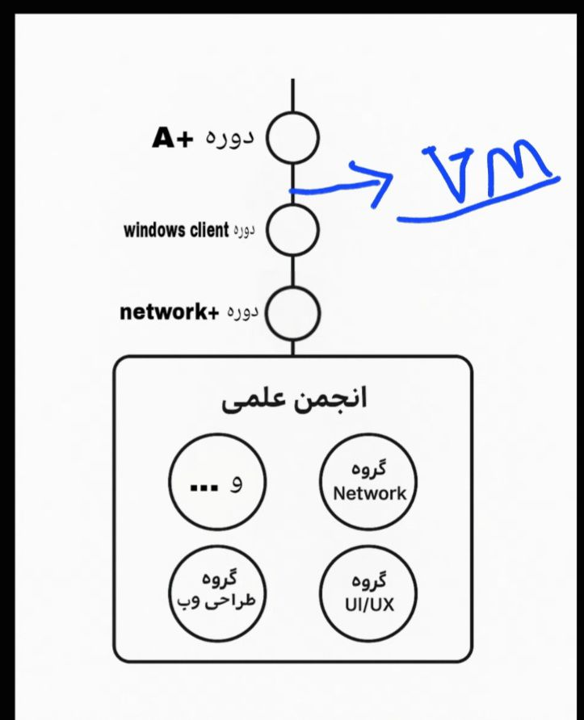
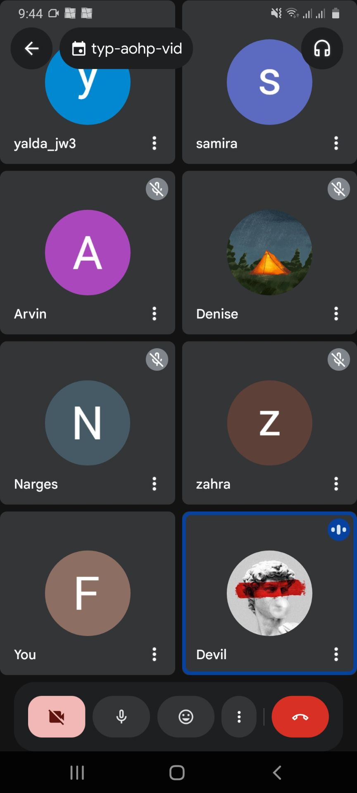

# 📑 گزارش راهبردی: تبیین اکوسیستم مهارت‌های پایه مهندسی کامپیوتر
> مرجع: 2025-11-30 | **بستر برگزاری :** Google Meet

## 📅 ۱. جزئیات جلسه
* **محور جلسه:** ساختاردهی به یادگیری هدفمند (مثلث مهارت)
* **تاریخ:** ۹ آذر ۱۴۰۴ (30 Nov 2025)
* **ارائه‌دهنده:** [شهاب شجاعی]
* **جامعه هدف:** دانشجویان فنی و اعضای هسته مرکزی

## 🎯 ۲. اهداف استراتژیک و خروجی‌ها 
هدف از این نشست، انتقال دانش فنی نبود، بلکه **«مهندسیِ مسیر»** با تمرکز بر موارد زیر بود:
* **واکاوی مثلث پایه:** تبیین هم‌گرایی بین سه حوزه A+, Windows Client و +Network.
* **متدولوژی "از صفر":** ارائه فریم‌ورک گام‌به‌گام برای تبدیل یک کاربر عادی به یک متخصص تحلیل‌گر.
* **استانداردسازی مستندات:** آموزش اصول Document-driven Development در محیط GitHub.

## 📽 ۳. مستندات بصری 

### 📸 تحلیل بصری اسلایدها و مشارکت
| پرزنت نقشه راه عملیاتی | نشست پایانی و تبادل نظر |
| :---: | :---: |
|  |  |
| *شکل ۱: تشریح لایه‌های انتزاعی مثلث مهارت* | *شکل ۲: تاییدیه حضور و شبکه سازی اعضا* |

## 🛠 ۴. خلاصه سرفصل‌های تخصصی 
در این نشست بر اولویت‌بندی یادگیری زیرساخت به جای ابزارگرایی تاکید شد:
1. **Infrastructure Foundations:** لزوم درک لایه فیزیکی و سخت‌افزار پیش از ورود به لایه‌های بالاتر.
2. **OS Management:** تسلط بر مدیریت کلاینت به عنوان اولین ایستگاه تعامل فنی.
3. **Networking Logic:** فهم منطق انتقال داده در مدل OSI به عنوان ستون فقرات مهندسی کامپیوتر.

