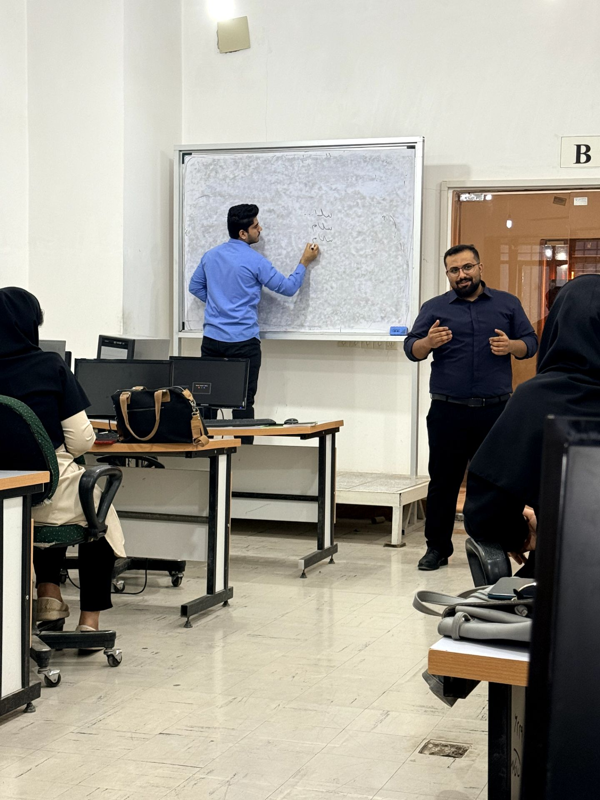

# 📑 گزارش راهبردی: جلسه آشنایی با بازار کار طراحی وب  
> **مرجع:** 2025-12-17 | **بستر برگزاری:** نشست حضوری انجمن  

## 📅 ۱. جزئیات جلسه
* **محور جلسه:** بررسی بازار کار طراحی وب با تمرکز بر Frontend و زبان برنامه نویسی JavaScript  
* **تاریخ:** ۲۶ آذر ۱۴۰۴ (17 Dec 2025)  
* **ارائه‌دهنده:** [ فردین فرخ زاد ] 
* **جامعه هدف:** دانشجویان تازه‌وارد به انجمن  

## 🎯 ۲. اهداف استراتژیک و خروجی‌ها 
هدف از این نشست، آشنایی دانشجویان تازه‌وارد با مسیرهای شغلی حوزه طراحی وب، به‌ویژه بخش Frontend، و ایجاد دید واقع‌بینانه نسبت به بازار کار این حوزه بود.  
در این جلسه تلاش شد تا شرکت‌کنندگان با مزایا، چالش‌ها و مهارت‌های موردنیاز برای ورود به بازار کار JavaScript آشنا شوند و بتوانند تصمیم آگاهانه‌تری برای مسیر یادگیری و فعالیت حرفه‌ای خود بگیرند.

## 📽 ۳. مستندات بصری 

### 📸 مستندات جلسه
| نمای کلی جلسه |
| :---: |
|  |
| *تصویر: پرسش و پاسخ و تعامل با دانشجویان* |

## 🛠 ۴. خلاصه سرفصل‌های تخصصی 
در این نشست به موضوعات زیر پرداخته شد:
- معرفی کلی بازار کار طراحی وب و جایگاه Frontend  
- بررسی نقش و کاربرد زبان JavaScript در پروژه‌های واقعی  
- مزایای فعالیت در حوزه Frontend (فرصت‌های شغلی، رشد، تنوع پروژه‌ها)  
- چالش‌ها و معایب این مسیر (رقابت، نیاز به یادگیری مستمر، فشار کاری)  
- ارائه توصیه‌هایی برای دانشجویان تازه‌وارد جهت شروع مسیر یادگیری و ورود به بازار کار  

