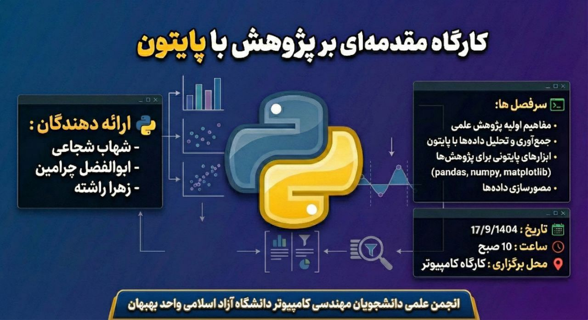
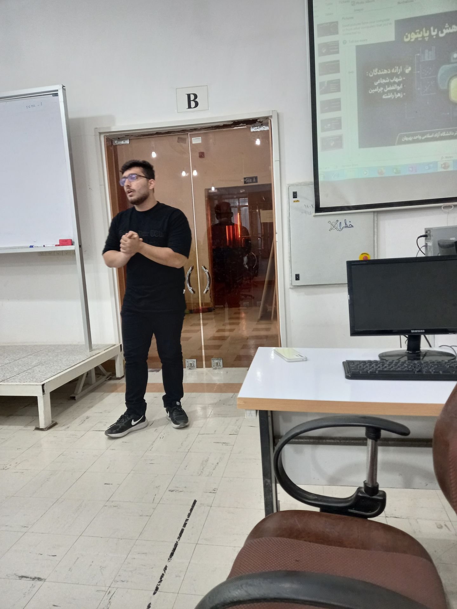
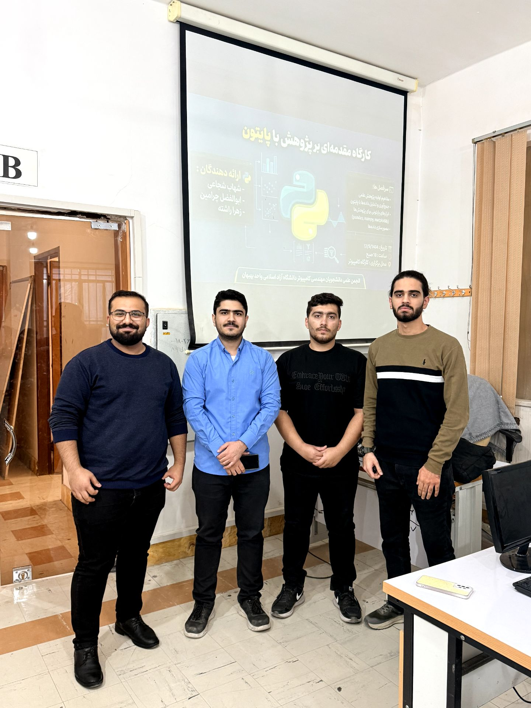

# 📑 گزارش راهبردی: کارگاه حضوری «مقدمه‌ای بر پژوهش با زبان برنامه‌نویسی پایتون»
> **مرجع:** 2025-12-25 | **بستر برگزاری:** کارگاه حضوری در دانشگاه  

## 📅 ۱. جزئیات جلسه
* **محور جلسه:** آموزش اصول پژوهش علمی و نحوه نگارش مقاله با استفاده از زبان برنامه‌نویسی پایتون  
* **تاریخ:** ۴ دی ۱۴۰۴ (25 Dec 2025)  
* **ارائه‌دهنده:** [ابوالفضل چرامین، شهاب شجاعی ] 
* **جامعه هدف:** دانشجویان علاقه‌مند به پژوهش، برنامه‌نویسی و نگارش مقالات علمی  

## 🎯 ۲. اهداف استراتژیک و خروجی‌ها 
هدف از برگزاری این کارگاه، آشنایی دانشجویان با فرآیند انجام یک پژوهش علمی مبتنی بر داده و استفاده از زبان برنامه‌نویسی پایتون در مراحل مختلف تحقیق بود.  

در این نشست، شرکت‌کنندگان با ساختار کلی یک مقاله علمی، نحوه جمع‌آوری و تحلیل داده‌ها، و اهمیت کار تیمی در پروژه‌های پژوهشی آشنا شدند. همچنین تلاش شد تا دید عملی و کاربردی نسبت به پژوهش داده‌محور در میان دانشجویان ایجاد شود.

## 📽 ۳. مستندات بصری 

### 📸 تحلیل بصری اسلایدها و مشارکت
| پوستر برگزاری کارگاه | ارائه‌دهندگان کارگاه | نشست پایانی |
| :---: | :---: | :---: |
|  |  |  |
| *تصویر ۱: پوستر رسمی برگزاری کارگاه* | *تصویر ۲: ارائه مباحث توسط مدرسین* | *تصویر ۳: پایان جلسه و جمع‌بندی نهایی* |

## 🛠 ۴. خلاصه سرفصل‌های تخصصی 
در این کارگاه به موضوعات زیر پرداخته شد:
- معرفی پژوهش علمی و مراحل اصلی نگارش مقاله  
- نقش زبان برنامه‌نویسی پایتون در تحلیل داده‌های پژوهشی  
- نحوه تقسیم وظایف در یک تیم پژوهشی  
  - جمع‌آوری داده برای مقاله  
  - تحلیل و پردازش داده‌ها با پایتون  
  - نگارش گزارش و مقاله به زبان انگلیسی  
- آشنایی با همکاری تیمی در پروژه‌های تحقیقاتی  
- پاسخ به پرسش‌های شرکت‌کنندگان و بررسی تجربیات عملی  

